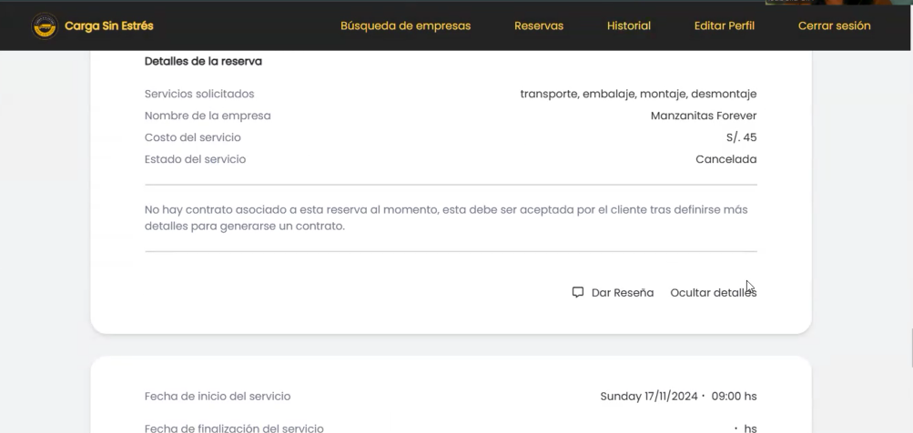
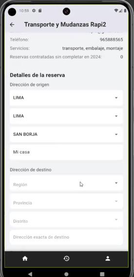
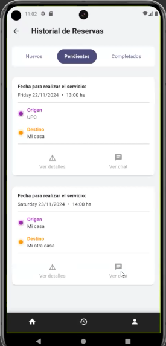
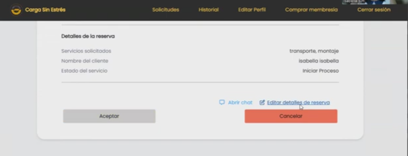

Carga Sin Estrés – Aplicación web y mobile para realizar solicitudes de reservas de mudanza

  

**📖 Descripción**

"Carga Sin Estrés" surgió como una oportunidad para 
mejorar la seguridad y comunicación entre dos tipos de 
usuarios: Clientes y empresas de mudanzas. A través de
esta aplicación, los clientes 
pueden describir sus necesidades de mudanza y recibir 
propuestas detalladas de empresas de mudanzas asociadas.
Por otro lado, las empresas de mudanzas obtienen 
visibilidad y prestigio por un servicio satisfactorio,
lo cual ayudará en su funcionamiento. 

El sistema permite a los ususarios:

**Para Cliente (web y mobile)**
1. Registro de usuario tipo cliente
2. Inicio de sesión a la aplicación
3. Cerrar Sesión en la aplicación
4. Búsqueda de empresas
5. Filtrar empresas por servicios, ubicación y nombre de la empresa
6. Visualizar perfil de empresa
7. Solicitud de reserva de un servicio a una empresas de mudanzas
8. Agregar mensaje en el chat de una solicitud para conversar con la empresa
9. Solicitar servicio de Carga Rápida
10. Realizar una reseña a una empresa
11. Edición de los datos de cuenta de cliente
12. Visualizar historial de servicios contratados
13. Cancelación de una solicitud de reserva en el Historial de solicitudes
14. Generar contrato con Blockchain, cuando la solicitud de reserva sea aceptada
15. Visualizar detalles de una reserva

**Para Organizer (web)**
1. Registro de usuario tipo empresa
2. Inicio de sesión a la aplicación
3. Edición de los datos de cuenta de empresa
4. Cerrar Sesión en la aplicación
5. Cancelación de una solicitud de reserva en el Historial de solicitudes
6. Agregar mensaje en el chat de una solicitud para conversar con el cliente
7. Historial de servicios contratados
8. Visualizar detalles de una reserva

**🛠️ Tecnologías Utilizadas**

- Frontend: Angular, CSS, TypeScript
- Mobile: Dart, Flutter
- Backend: SpringBoot, Java
- Base de datos: MySQL
- Contratos inteligentes con Blockchain: Ethereum
- Autenticación: JSON Web Tokens (JWT)
- Despliegue: AWS

***
**🎨 Capturas de Pantalla** 

**💻 Aplicación Web para Cliente**

Página de Registro de Usuario
<td></td>
<td></td>

Página de Login
<td></td>

Búsqueda de empresas segun filtros por servicios, ubicación y nombre 
<td></td>

Visualizar perfil de una empresa seleccionada
<td></td>

Solicitud de reserva de un servicio a una empresas de mudanzas
<td></td>
<td></td>
<td></td>

Visualizar detalles de una reserva
<td></td>

Agregar mensaje en el chat de una solicitud para conversar con la empresa
<td></td>

Solicitar servicio de Carga Rápida
<td></td>

Realizar una reseña a una empresa despues de finalizar una reserva
<td></td>
<td></td>

Visualizar historial de servicios contratados
<td></td>

Cancelación de una solicitud de reserva en el Historial de solicitudes
<td></td>

Generar contrato con Blockchain, cuando la solicitud de reserva sea aceptada
<td></td>
<td></td>

**📱 Aplicación Mobile para Cliente**

Página de registro de Usuario
<td></td>

Página de login
<td></td>

Editar perfil del cliente
<td></td>

Búsqueda de empresas segun filtros por servicios, ubicación y nombre
<td></td>

Visualizar perfil de una empresa seleccionada
<td></td>

Solicitud de reserva de un servicio a una empresas de mudanzas
<td></td>
<td></td>
<td></td>

Visualizar detalles de una reserva
<td></td>

Agregar mensaje en el chat de una solicitud para conversar con la empresa
<td></td>

Visualizar historial de servicios contratados
<td></td>

Cancelación de una solicitud de reserva en el Historial de solicitudes
<td></td>

Generar contrato con Blockchain, cuando la solicitud de reserva sea aceptada
<td></td>
<td></td>

***
**💻 Aplicación Web para Empresas de Mudanza**

 Pagina de registro de empresa de mudanza
<td></td>
<td></td>

Página de Login
<td></td>

Editar perfil de empresa
<td></td>

Visualizar detalles de una reserva
<td></td>

Editar detalles de una reserva
<td></td>
<td></td>

Agregar mensaje en el chat de una solicitud para conversar con el cliente
<td></td>

Visualizar historial de servicios contratados
<td></td>

Cancelación de una solicitud de reserva en el Historial de solicitudes
<td></td>

**🔗 Enlace de los repositorio del proyecto:**

Frontend: https://github.com/SI728-Emergentes-CargaSinEstres/Carga-Sin-Estres-Frontend

Backend: https://github.com/SI728-Emergentes-CargaSinEstres/Carga-Sin-Estres-Backend

Mobile: https://github.com/SI728-Emergentes-CargaSinEstres/mobile-app

