

The Big Fun – Aplicación web y mobile de publicidad y reserva de eventos sociales

  

**📖 Descripción**

The Big Fun” surgió para facilitar la búsqueda de eventos sociales, así como la publicidad de estos.  La solución busca satisfacer a dos tipos de usuarios: Attendee (asistente a eventos) y Organizer (organizador de eventos). Como funcionalidad adicional se incluyó la simulación de conexión con un dispositivo IoT, una pulsera inteligente, el cual recopila datos de ubicación GPS y salud para mostrarlo en aplicación. El sistema permite a los usuarios: 

**Para Attendee (web y mobile)**

1. Visualizar una lista de eventos
2. Conocer los detalles de un evento en específico.
3. Compra de entradas a través de una pasarela de pagos dentro de la aplicación
4. Adquisición de un QR único para poder validar su acceso al evento

**Para Organizer (web)**

1. Creación de eventos
2. Visualizar detalles del evento creado

**Para Organizer (mobile)**

1. Visualizar lista de asistentes de un evento en especifico
2. Escaneo de códigos QR para validar la asistencia y brindar dispositivo IoT, una pulsera inteligente.
3. Monitoreo a tiempo real de la ubicación de un asistente y su estado de salud según datos recopilados por la pulsera inteligente.

**🛠️ Tecnologías Utilizadas**

- Frontend: Angular, CSS, TypeScript
- Mobile: Dart, Flutter
- Backend: SpringBoot, Java
- Base de datos: MySQL
- Dispositivo IoT: Wokwi, librerías de HTTP, Json, C++
- Autenticación: JSON Web Tokens (JWT)
- Despliegue: AWS

***
**🎨 Capturas de Pantalla** 

**💻 Aplicación Web**

Página de Registro de Usuario
<td>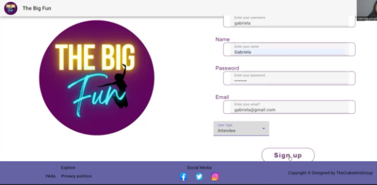</td>

Página de Login
<td>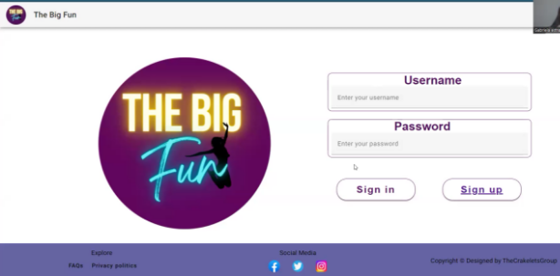</td>

**💻Aplicación Web para Attendee**

Lista de eventos
<td>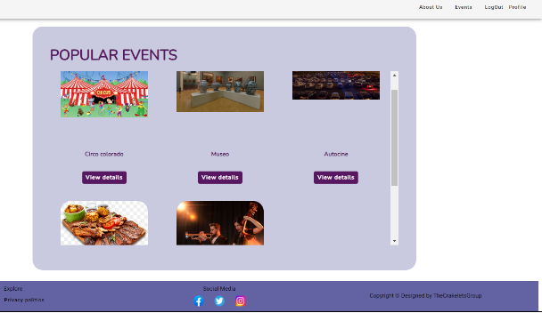</td>

Detalles de un evento
<td>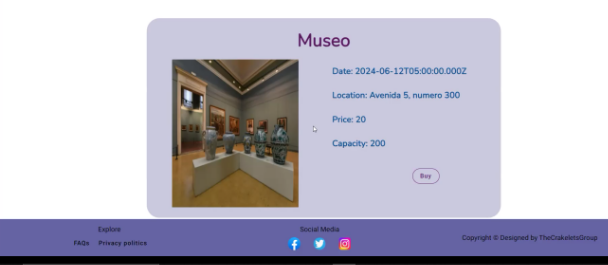</td>

Compra a través de pasarela de pagos 
<td>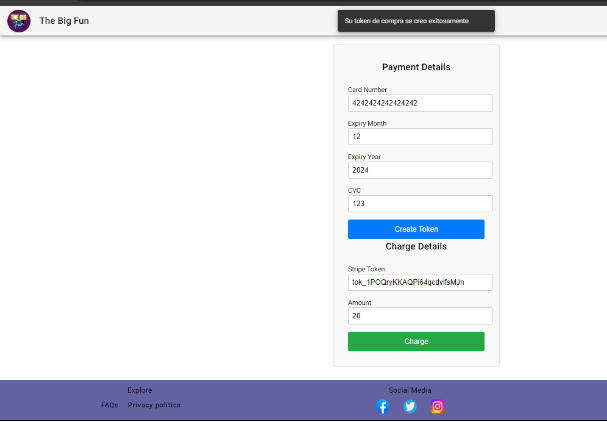</td>

Confirmación de compra y generación de QR
<td>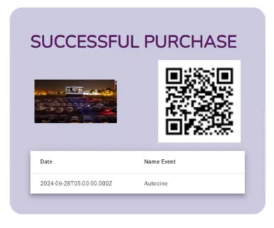</td>

**💻Aplicación Web para Organizer**

Crear un evento
<td>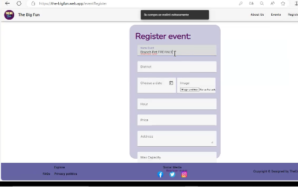</td>

Visualizar detalles del evento creado
<td>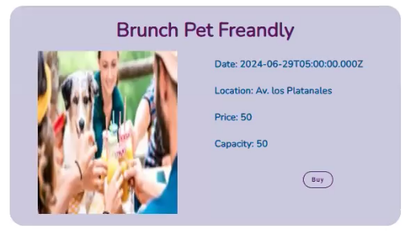</td>

***
**📱 Aplicación Mobile**

Página de Registro de Usuario
<td>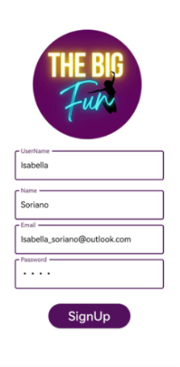</td>

Página de Login
<td>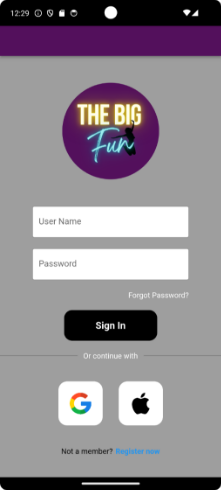</td>

**📱 Aplicación Mobile para Attendee**

Lista de eventos
<td>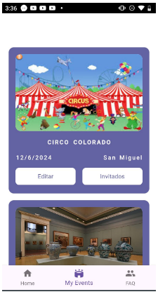</td>

Detalles de un evento
<td>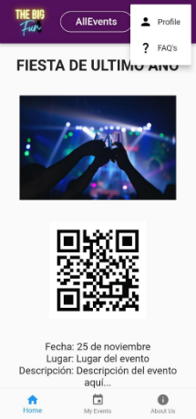</td>

Compra a través de pasarela de pagos
<td>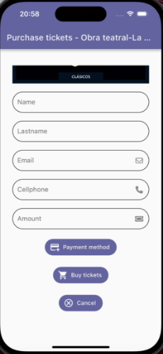</td>

Confirmación de compra y generación de QR
<td>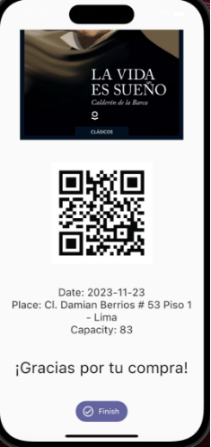</td>

**📱 Aplicación Mobile para Organizer**

Visualizar lista de asistentes de un evento
<td>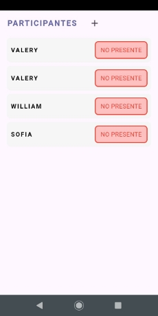</td>

Escaneo de códigos QR para validar la asistencia y asociar un dispositivo IoT
<td>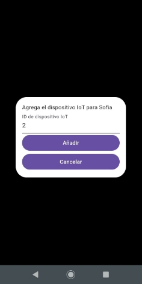</td>
<td>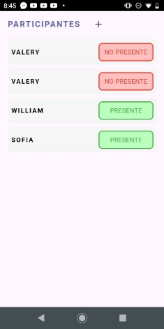</td>

Monitoreo a tiempo real de la ubicación de un asistente y su estado de salud
<td>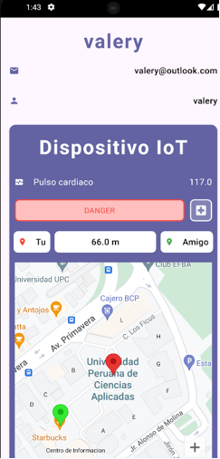</td>

🔗 Enlace del repositorio del proyecto: https://github.com/CrackeletsGroup-IoT

